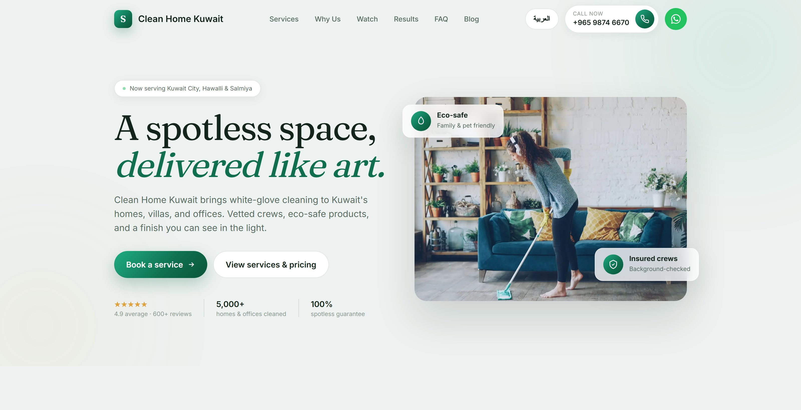

<div align="center">

# Clean Home Kuwait

**Premium cleaning services website — Kuwait**

A modern, fully responsive marketing and booking site for a Kuwait-based home, office, and commercial cleaning company. Built with Next.js 16, TypeScript, Tailwind CSS v4, and Framer Motion.

[](https://kuwait-cleaning-services.vercel.app/)

[](https://nextjs.org/)
[](https://react.dev/)
[](https://www.typescriptlang.org/)
[](https://tailwindcss.com/)
[](https://www.framer.com/motion/)
[](https://vercel.com/)

<br />



**[🌐 View Live Site →](https://kuwait-cleaning-services.vercel.app/)**

</div>

---

## Overview

Clean Home Kuwait is a conversion-focused landing page and micro-site for a residential and commercial cleaning business. It covers the full customer journey — discovering services, understanding pricing, reading trust signals, browsing content, and booking — with a polished, editorial design system and a bilingual (English / Arabic, RTL-aware) experience.

## Features

**Marketing & content**
- Animated hero with trust badges, ratings, and key stats
- Five service categories (House, Restaurant, Office, Mosque, Single Services) with detailed scope checklists
- "Why us" trust grid, 4-step "how it works" process timeline
- Before/after gallery showcasing real transformations
- Embedded video section ("See us in action")
- Auto-rotating client testimonials carousel with hover-to-pause
- FAQ accordion
- Full blog system — homepage coverflow carousel, a `/blog` index, and individual article pages with author bylines and related-articles

**Booking & conversion**
- Live instant-quote calculator (service × property size × frequency)
- One-tap Call and WhatsApp booking, with a persistent mobile call/WhatsApp bar
- Embedded location map and full contact details

**Engineering**
- Fully responsive from 320px phones through large desktops, with a dedicated mobile navigation menu
- Bilingual English/Arabic support with automatic RTL layout switching
- Smooth, consistent scroll and hover micro-animations throughout (Framer Motion)
- Centralized content model — all copy, pricing, services, and media driven from a single typed data file
- SEO metadata and structured data (`LocalBusiness` JSON-LD) out of the box

## Tech Stack

| Layer | Technology |
|---|---|
| Framework | [Next.js 16](https://nextjs.org/) (App Router, Turbopack) |
| Language | [TypeScript](https://www.typescriptlang.org/) |
| UI Library | [React 19](https://react.dev/) |
| Styling | [Tailwind CSS v4](https://tailwindcss.com/) (design tokens via `@theme`) |
| Animation | [Framer Motion](https://www.framer.com/motion/) |
| Fonts | Inter, Fraunces, Cairo — via `next/font/google` |
| Hosting | [Vercel](https://vercel.com/) |

## Getting Started

### Prerequisites

- Node.js 18.18+ (`node -v` to check)
- npm

### Installation

```bash
git clone https://github.com/MdShohag07/kuwait-cleaning-services.git
cd kuwait-cleaning-services
npm install
```

### Development

```bash
npm run dev
```

Open [http://localhost:3000](http://localhost:3000).

### Production build

```bash
npm run build
npm run start
```

### Lint

```bash
npm run lint
```

## Project Structure

```
kuwait-cleaning-services/
├── app/
│   ├── page.tsx              # Homepage — composes all sections
│   ├── layout.tsx            # Root layout, fonts, SEO metadata, JSON-LD
│   ├── globals.css           # Tailwind v4 theme tokens & base styles
│   └── blog/
│       ├── page.tsx          # Blog index
│       └── [slug]/page.tsx   # Individual blog post
├── components/                # One component per section (Hero, Services,
│                               # Why, Process, Video, BeforeAfter, Stats,
│                               # Testimonials, Blog, FAQ, BookingContact,
│                               # Navbar, Footer, MobileHookBar, LangSwitch…)
├── lib/
│   ├── site.ts                # Single source of truth for all site content
│   └── i18n.tsx                # English/Arabic language context + RTL handling
├── public/images/              # Service, hero, and before/after photography
└── docs/                       # README assets
```

## Content & Configuration

This project is designed so that **non-technical edits never require touching a component**:

- **All content** — brand name, phone/WhatsApp numbers, services & pricing, testimonials, FAQs, blog posts, stats — lives in [`lib/site.ts`](lib/site.ts).
- **Colors, fonts, and radii** are design tokens in the `@theme` block of [`app/globals.css`](app/globals.css).
- **Translations** for the language switcher live in [`lib/i18n.tsx`](lib/i18n.tsx).
- **Images** are served from `public/images/`; external image hosts must be allow-listed in [`next.config.ts`](next.config.ts).

## Deployment

The site is deployed on [Vercel](https://vercel.com/) and auto-deploys from the `main` branch.

**Live URL:** [https://kuwait-cleaning-services.vercel.app/](https://kuwait-cleaning-services.vercel.app/)

## License

This is a private, client-owned project. All rights reserved.
